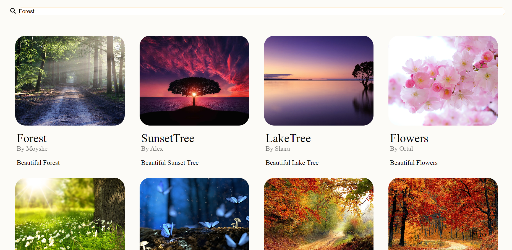
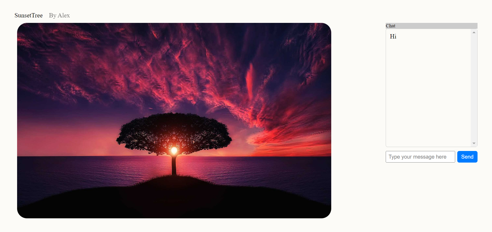
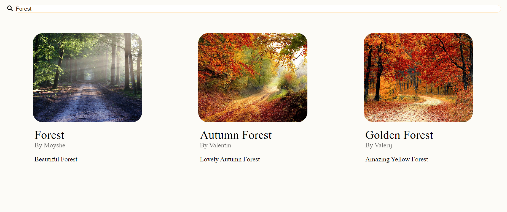

# .Net Angular Gallery.

The Gallery project is a web application built with Angular 16 on the client-side and .NET Core 6 on the backend. It allows users to view a gallery(hardcoded) of pictures, search for specific pictures by name or author, and engage in "real-time" chat discussions.

## Features

- **Gallery View**: Users can access the main page of the application, where they can see a collection of pictures in the gallery. The gallery displays images and relevant information about each picture.

- **Search Functionality**: Users can utilize the search feature to find specific pictures by their names or the names of their authors. This enables quick and efficient access to desired content.

* **Real-Time Chat Simulation**: The Gallery project includes a real-time chat simulation, enabling users to experience dynamic messaging in a multi-user environment. Although not involving real users, this simulation creates the appearance of real-time interactions, providing a learning experience on how messages propagate across different instances of the application.

## Technologies Used

- **Frontend**: Angular 16
- **Backend**: .NET Core 6
- **Real-time Communication**: SignalR

## Getting Started

To run the Gallery project locally, follow these steps:

1. Clone the repository to your local machine:
   ```
   git clone https://github.com/Maksss3000/.NETAngularGallery
   ```
2. Install the required dependencies for the frontend and backend:

   - Navigate to the Client directory and run `npm install` to install Angular dependencies.
   - Navigate to the API directory and restore the .NET Core dependencies using `dotnet restore`.

3. Launch the application:

   - Start the Angular development server by running `ng serve` or `npm run` in the Client directory.
   - Start the .NET Core API by running `dotnet run` in the API directory

4. Access the application:
   - Open your web browser and visit https://localhost:4200 to access the gallery frontend

## Gallery

### Maing page



### Chat



### Search


